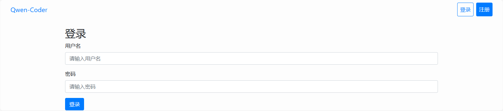
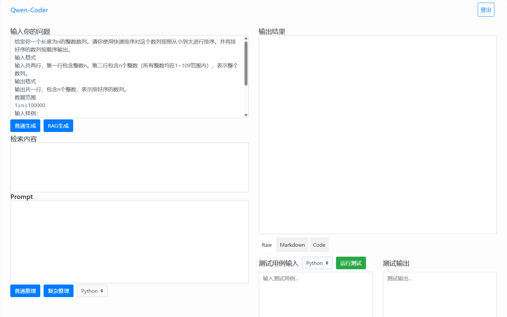

# Qwen_web

<b>添加了Dockerfile文件，可以使用Dockerfile来构建镜像，自动配置环境。</b>

- 运行方法

进入qwen_web文件夹，执行命令`python manager.py runserver`，模型默认加载到`cpu内存`上，推理速度可能较慢。如果想使用GPU，在`text_generation/view.py`文件中修改`device`为`cuda`即可。

## UI界面展示

### 登录页面

> 用户名：hjp 密码：123321asd

### 首页

- 使用方法

1. 在`输入你的问题`栏输入问题，点击`普通生成`，会在`Prompt`栏生成完整的<b>Prompt</b>，点击`RAG生成`，会在`检索内容`栏生成检索内容，并在`Prompt`生成加入检索内容的<b>Prompt</b>。
2. 点击`普通推理`，模型生成直白的回答，点击`复杂推理`，模型会生成更详细的回答，先生成推理步骤，再给出答案。生成答案可能较慢，不要反复点击。
3. 在`输出结果`栏下方，点击`Raw`会显示模型生成原始内容，点击`Markdown`会显示渲染后的内容，点击`Code`会提取出回答中的代码。
4. 提取代码后，可以对代码进行测试，在测试用例输入右边的选择框中选择测试语言，输入测试用例，点击`运行测试`，右边会显示测试结果。